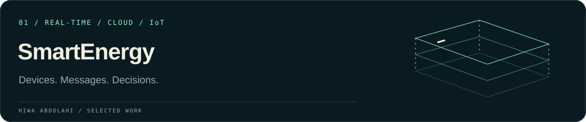
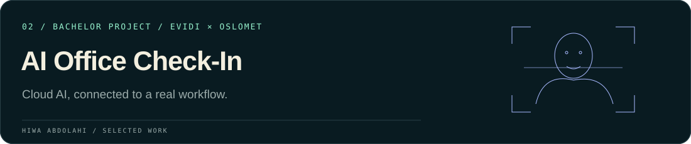
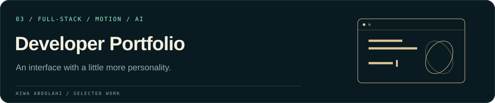
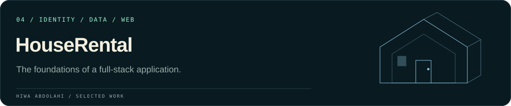

<picture>
  <source media="(max-width: 600px)" srcset="./assets/signature-hero-mobile.svg" />
  
</picture>

 

**[Explore my portfolio ↗](https://hiwa.azurewebsites.net)** &nbsp; · &nbsp; **[Connect on LinkedIn ↗](https://www.linkedin.com/in/hiwa-abdolahi-210b03208/)** &nbsp; · &nbsp; **[Get in touch ↗](mailto:hiwa.abdolahi.dev@gmail.com)**

Drammen, Norway &nbsp; / &nbsp; M.Sc. Informatics student &nbsp; / &nbsp; Open to opportunities

 

## A little context

I'm **Hiwa**, a software developer who likes understanding how the whole system fits together — from a message arriving at a backend service to the experience someone sees on screen.

I build with **C# / .NET and Azure**, and explore real-time systems, data and applied AI through hands-on projects. I hold a **B.Sc. in Information Technology from OsloMet** and am pursuing an **M.Sc. in Informatics at USN Kongsberg**.

What keeps me interested is the connection between the layers: how data moves, how services communicate and how an idea becomes something people can use.

 

## Selected work

### SmartEnergy · Real-time IoT platform

A cloud-connected project bringing together MQTT messaging, backend services and a real-time dashboard. Containerized services run on **Azure Container Apps**, with **GitHub Actions** handling deployment.

**Engineering focus:** connecting telemetry, secure messaging and live updates across service boundaries.

`C#` `.NET 8` `MQTT` `WebSockets` `Docker` `Azure Container Apps` `GitHub Actions`

**[Explore the code ↗](https://github.com/HiwaAbdolahi/SmartEnergy)** &nbsp; · &nbsp; **[Open demo ↗](https://smartenergy-dev.calmmushroom-56122533.norwayeast.azurecontainerapps.io/)**

 

### AI Office Check-In · Bachelor project with Evidi AS

An office check-in application developed in collaboration with **Evidi AS and OsloMet**. It brings **Azure Face API**, authentication, Cosmos DB and Blob Storage together in an ASP.NET Core application.

**Engineering focus:** integrating a cloud AI service with an application's identity, data and image-storage workflows.

`C#` `ASP.NET Core` `Azure Face API` `Cosmos DB` `Blob Storage` `Identity`

**[Explore the bachelor project ↗](https://github.com/HiwaAbdolahi/bachelorOppgave2024EvidiOsloMet)**

 

### Developer Portfolio · Software meets interface design

My own space for presenting projects and the thinking behind them. Built with **ASP.NET Core MVC**, it combines an AI assistant, GSAP animations, project galleries and interactive architecture diagrams.

**Engineering focus:** connecting backend functionality to a responsive, expressive user interface.

`ASP.NET Core MVC` `JavaScript` `GSAP` `Azure` `AI integration`

**[Visit the portfolio ↗](https://hiwa.azurewebsites.net)** &nbsp; · &nbsp; **[Explore the code ↗](https://github.com/HiwaAbdolahi/PortfolioWebsite)**

 

### HouseRental · Full-stack rental application

A rental application covering property management, authentication, database persistence and image handling, with a responsive interface and Azure deployment.

**Engineering focus:** connecting application logic, user access and persistent data in one complete web application.

`C#` `ASP.NET Core MVC` `Entity Framework Core` `Identity` `Azure`

**[Explore the code ↗](https://github.com/HiwaAbdolahi/HouseRentalProject)** &nbsp; · &nbsp; **[Open demo ↗](https://houserental.azurewebsites.net/)**

 

## My working toolkit

The technologies I use in projects — and the areas I'm still developing.

| Area | Tools & experience |
|:---|:---|
| **Backend** | C#, .NET, ASP.NET Core MVC, Entity Framework Core, Identity |
| **Cloud & delivery** | Azure App Service, Container Apps, Docker, GitHub Actions, Git |
| **Data & messaging** | SQL, SQLite, Cosmos DB, Blob Storage, MQTT, WebSockets |
| **Interfaces** | JavaScript, HTML, CSS, Bootstrap, GSAP |
| **Testing & analysis** | JUnit, Selenium, SoapUI, Postman; Python, Pandas, scikit-learn |
| **Currently developing** | TypeScript, MongoDB, data engineering and distributed systems |

 

## Beyond the featured projects

| Project | What it explores |
|:---|:---|
| **[Software Testing ↗](https://github.com/HiwaAbdolahi/TestingAvProgramvare)** | Software quality with JUnit, Selenium and SoapUI |
| **[AI / ML Lab ↗](https://github.com/HiwaAbdolahi/My_lab_AI_Labs)** | Python, regression, Random Forest and model evaluation |
| **[Network Analysis ↗](https://github.com/HiwaAbdolahi/sky)** | Network performance, bandwidth and latency with Python and Mininet |
| **[Algorithms & Data Structures ↗](https://github.com/HiwaAbdolahi/algoritmerOgDatastrukturer-master)** | Search trees, traversal and algorithmic problem solving |

 

## Still building. Still learning.

**2026 — Present · M.Sc. Informatics, USN Kongsberg**  
Expanding my understanding of data management, cloud technologies and distributed systems.

**2021 — 2024 · B.Sc. Information Technology, OsloMet**  
Software development, databases, algorithms, AI, testing, operating systems and information security.

I learn best by building something, understanding the trade-offs and improving it. I'm looking for a team where I can contribute that curiosity, learn from others and take responsibility for useful software.

<b>GitHub activity & language overview</b>

 

These optional cards use an external service. [View my repositories directly](https://github.com/HiwaAbdolahi?tab=repositories) if they are unavailable. Language statistics describe repository contents, not proficiency.

 

<a href="mailto:hiwa.abdolahi.dev@gmail.com">
<picture>
  <source media="(max-width: 600px)" srcset="./assets/signature-footer-mobile.svg" />
  
</picture>
</a>

**[Portfolio ↗](https://hiwa.azurewebsites.net)** &nbsp; · &nbsp; **[LinkedIn ↗](https://www.linkedin.com/in/hiwa-abdolahi-210b03208/)** &nbsp; · &nbsp; **[Email ↗](mailto:hiwa.abdolahi.dev@gmail.com)**

Designed around the work. Built to keep evolving.

