<picture>
  <source media="(max-width: 600px)" srcset="./assets/signature-hero-mobile.svg" />
  
</picture>

 

**[Explore my portfolio ↗](https://hiwa.azurewebsites.net)** &nbsp; · &nbsp; **[Connect on LinkedIn ↗](https://www.linkedin.com/in/hiwa-abdolahi-210b03208/)** &nbsp; · &nbsp; **[Get in touch ↗](mailto:hiwa.abdolahi.dev@gmail.com)**

Drammen, Norway &nbsp; / &nbsp; B.Sc. · OsloMet &nbsp; / &nbsp; M.Sc. · USN Kongsberg · in progress

 

## Software that connects the pieces

I'm **Hiwa**, a software developer who likes understanding how the whole system fits together — from a message arriving at a backend service to the experience someone sees on screen.

I build with **C# / .NET and Azure**, and explore real-time systems, data and applied AI through hands-on projects. I hold a **B.Sc. in Information Technology from OsloMet** and am pursuing an **M.Sc. in Informatics at USN Kongsberg**.

**Looking for my next step:** a junior software developer, .NET or full-stack role in Norway, with a team where I can contribute, learn and grow.

**[Selected work](#selected-work)** · **[Inside the system](#inside-smartenergy)** · **[Code anatomy](#code-anatomy)** · **[Education](#education)** · **[Contact](#lets-build-something-useful)

 

## Selected work

### SmartEnergy · Real-time IoT platform

A cloud-connected project bringing together MQTT messaging, backend services and a real-time dashboard. Containerized services run on **Azure Container Apps**, with **GitHub Actions** handling deployment.

**Inside the code:** a .NET background worker consumes temperature messages and publishes heater commands. The dashboard, broker and worker run as three containers, with a GitHub Actions deployment workflow.

`C#` `.NET 8` `MQTT` `WebSockets` `Docker` `Azure Container Apps` `GitHub Actions`

**[Explore the code ↗](https://github.com/HiwaAbdolahi/SmartEnergy)** &nbsp; · &nbsp; **[Open demo ↗](https://smartenergy-dev.calmmushroom-56122533.norwayeast.azurecontainerapps.io/)**

 

### AI Office Check-In · Bachelor project with Evidi AS

A **four-person bachelor team project**, developed in collaboration with **Evidi AS and OsloMet**. It brings **Azure Face API**, authentication, Cosmos DB and Blob Storage together in an ASP.NET Core application.

**Engineering focus:** integrating a cloud AI service with an application's identity, data and image-storage workflows.

`C#` `ASP.NET Core` `Azure Face API` `Cosmos DB` `Blob Storage` `Identity`

**[Explore the bachelor project ↗](https://github.com/HiwaAbdolahi/bachelorOppgave2024EvidiOsloMet)**

 

### Developer Portfolio · Software meets interface design

My own space for presenting projects and the thinking behind them. Built with **ASP.NET Core MVC**, it combines an AI assistant, GSAP animations, project galleries and interactive architecture diagrams.

**Inside the code:** an ASP.NET Core chat controller connects the interface to an AI service and keeps conversation context in the user session.

`ASP.NET Core MVC` `JavaScript` `GSAP` `Azure` `AI integration`

**[Visit the portfolio ↗](https://hiwa.azurewebsites.net)** &nbsp; · &nbsp; **[Explore the code ↗](https://github.com/HiwaAbdolahi/PortfolioWebsite)**

 

### HouseRental · Full-stack rental application

A rental application covering property management, authentication, database persistence and image handling, with a responsive interface and Azure deployment.

**Inside the code:** authorized property-management actions, a repository layer, Entity Framework persistence and image uploads.

`C#` `ASP.NET Core MVC` `Entity Framework Core` `Identity` `Azure`

**[Explore the code ↗](https://github.com/HiwaAbdolahi/HouseRentalProject)** &nbsp; · &nbsp; **[Open demo ↗](https://houserental.azurewebsites.net/)**

 

## Inside SmartEnergy

A small control loop with several engineering concerns: message delivery, connection recovery, state updates and container deployment. The animation illustrates the documented flow; it is not live telemetry.

<strong>For the technical reader — start with these files</strong>

| Question | Where to look |
|:---|:---|
| How does a reading become a decision? | [SmartEnergy worker](https://github.com/HiwaAbdolahi/SmartEnergy/blob/master/workerC/Worker.cs) — temperature parsing, control rule, retained commands and reconnect handling |
| How does the system reach Azure? | [Deployment workflow](https://github.com/HiwaAbdolahi/SmartEnergy/blob/master/.github/workflows/deploy.yml) — container build and deployment |
| How is AI connected to the interface? | [Portfolio chat controller](https://github.com/HiwaAbdolahi/PortfolioWebsite/blob/master/Controllers/ChatController.cs) — API integration and session context |
| How are rental properties managed? | [HouseRental controller](https://github.com/HiwaAbdolahi/HouseRentalProject/blob/master/Controllers/HouseController.cs) — authorized actions, repository access and uploads |

 

## Code anatomy

<picture>
  <source media="(max-width: 600px)" srcset="./assets/code-anatomy-mobile.svg" />
  
</picture>

The source behind the projects, measured by **file count**. This describes the repositories, including the bachelor team's shared code; it does not measure personal authorship or proficiency.

Inspect the numbers &amp; how the graphic was built

| Language / template | Files |
|:---|---:|
| C# | 60 |
| Razor | 50 |
| JavaScript | 10 |
| CSS | 11 |
| HTML | 1 |
| **Total** | **132** |

Snapshot: **17 September 2026**. Four featured repositories only. Generated build output, vendored libraries, migrations, Identity scaffold folders and minified files are excluded. This is a dated inventory, not live contribution activity or GitHub's byte-based language statistic.

[Inspect the source inventory](./data/profile-code-snapshot.json) · [Read the methodology](./PROFILE-DESIGN.md) · [See the SVG generator](./scripts/build-profile.mjs)

 

## My working toolkit

The technologies I use in projects — and the areas I'm still developing.

| Area | Tools & experience |
|:---|:---|
| **Backend** | C#, .NET, ASP.NET Core MVC, Entity Framework Core, Identity |
| **Cloud & delivery** | Azure App Service, Container Apps, Docker, GitHub Actions, Git |
| **Data & messaging** | SQL, SQLite, Cosmos DB, Blob Storage, MQTT, WebSockets |
| **Interfaces** | JavaScript, HTML, CSS, Bootstrap, GSAP |
| **Testing & analysis** | JUnit, Selenium, SoapUI, Postman; Python, Pandas, scikit-learn |
| **Currently developing** | TypeScript, MongoDB, data engineering and distributed systems |

 

<strong>More projects — testing, machine learning, networks and algorithms</strong>

| Project | What it explores |
|:---|:---|
| **[Software Testing ↗](https://github.com/HiwaAbdolahi/TestingAvProgramvare)** | Software quality with JUnit, Selenium and SoapUI |
| **[AI / ML Lab ↗](https://github.com/HiwaAbdolahi/My_lab_AI_Labs)** | Python, regression, Random Forest and model evaluation |
| **[Network Analysis ↗](https://github.com/HiwaAbdolahi/sky)** | Network performance, bandwidth and latency with Python and Mininet |
| **[Algorithms & Data Structures ↗](https://github.com/HiwaAbdolahi/algoritmerOgDatastrukturer-master)** | Search trees, traversal and algorithmic problem solving |

 

## Education

<picture>
  <source media="(max-width: 600px)" srcset="./assets/education-journey-mobile.svg" />
  
</picture>

Degree details &amp; academic foundation

| Qualification | Institution & campus | Period | Status |
|:---|:---|:---|:---|
| **B.Sc. in Information Technology** | Oslo Metropolitan University (OsloMet), Oslo | 2021–2024 | Completed |
| **M.Sc. in Informatics** | University of South-Eastern Norway (USN), Kongsberg | 2026–present | In progress |

**Bachelor foundation:** software development, databases, algorithms, AI, software testing, operating systems and information security. My bachelor project was an [AI office check-in application developed with Evidi AS and OsloMet](https://github.com/HiwaAbdolahi/bachelorOppgave2024EvidiOsloMet).

**Current focus:** developing my understanding of data management, cloud technologies and distributed systems through my master's studies and projects.

 

## Let's build something useful

I'm interested in **junior software development, .NET and full-stack opportunities in Norway**. My strongest project experience connects backend development, Azure deployment and user-facing applications.

If that fits your team, I'd be happy to discuss the work, the decisions behind it and where I can contribute.

**[Email me ↗](mailto:hiwa.abdolahi.dev@gmail.com)** · **[Connect on LinkedIn ↗](https://www.linkedin.com/in/hiwa-abdolahi-210b03208/)** · **[Browse my repositories ↗](https://github.com/HiwaAbdolahi?tab=repositories)**

 

<a href="mailto:hiwa.abdolahi.dev@gmail.com">
<picture>
  <source media="(max-width: 600px)" srcset="./assets/signature-footer-mobile.svg" />
  
</picture>
</a>

**[Portfolio ↗](https://hiwa.azurewebsites.net)** &nbsp; · &nbsp; **[LinkedIn ↗](https://www.linkedin.com/in/hiwa-abdolahi-210b03208/)** &nbsp; · &nbsp; **[Email ↗](mailto:hiwa.abdolahi.dev@gmail.com)**

Custom SVG artwork · documented source data · <a href="./PROFILE-DESIGN.md">How this profile is built</a>

